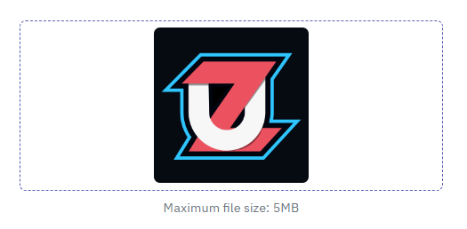

# File Upload Component

A Vue 3 drag-and-drop file upload component with validation, preview, and error handling.

## Features

- Drag and drop file upload  
- Click to open file selector  
- Image preview for images  
- File type icons for other file types (PDF, Word, Text, Excel)  
- File validation (type and size restrictions)  
- Customizable placeholder and helper text  
- Error handling with user feedback  
- **Customizable upload icon using a slot**  

## Demo  


---

## Installation  

This component is designed to be used in a Vue 3 project with the Composition API.  

```bash
npm i vue3-fileinput
```  

---

## Usage  

### 1. Local Registration (Single Component Usage)  

Import and use the component in a specific Vue file:  

```vue
<template>
  <FileUpload
    v-model="uploadedFile"
    :fileType="['image/png', 'image/jpeg', 'application/pdf']"
    :maxSize="5 * 1024 * 1024"
    placeholder="Drop your file here"
    helperText="Max size: 5MB"
  />
</template>

<script setup>
import { ref } from "vue";
import { FileUpload } from "vue3-fileinput"; // Corrected import

const uploadedFile = ref(null);
</script>
```

---

### 2. Global Registration (Use in Entire App)  

To register the component globally in your Vue 3 project:  

#### Step 1: Register in `main.js` or `main.ts`  

```javascript
import { createApp } from "vue";
import App from "./App.vue";
import Vue3Fileinput from "vue3-fileinput"; // Corrected import

const app = createApp(App);

app.use(Vue3Fileinput); // Register globally
app.mount("#app");
```

#### Step 2: Use in Any Component  

Once registered globally, you can **use `<FileUpload>` anywhere** without importing it again:  

```vue
<template>
  <FileUpload v-model="uploadedFile" />
</template>

<script setup>
import { ref } from "vue";

const uploadedFile = ref(null);
</script>
```

---

## Slots  

| Slot Name  | Description                                              |
| ---------- | -------------------------------------------------------- |
| `icon`     | Slot for customizing the upload icon inside the drop zone |

### Using the Slot for Custom Icons  

```vue
<FileUpload v-model="uploadedFile">
  <template #icon>
    <i class="fas fa-folder-plus upload-icon"></i>
  </template>
</FileUpload>
```

---

## Props  

| Prop Name     | Type      | Default                                                                     | Description                                |
| ------------- | --------- | --------------------------------------------------------------------------- | ------------------------------------------ |
| `modelValue`  | `File`    | `null`                                                                      | The selected file                          |
| `required`    | `Boolean` | `false`                                                                     | Whether file upload is mandatory           |
| `fileType`    | `Array`   | `['image/png', 'image/jpeg', 'image/jpg', 'application/pdf', 'text/plain']` | Allowed file types                         |
| `placeholder` | `String`  | `'Drag and drop a file here'`                                               | Placeholder text before file selection     |
| `helperText`  | `String`  | `''`                                                                        | Additional helper text below the drop zone |
| `maxSize`     | `Number`  | `2 * 1024 * 1024` (2MB)                                                     | Maximum file size allowed                  |
| `maxFiles`    | `Number`  | `1`                                                                         | Maximum number of files allowed            |
| `inValid`     | `Boolean` | `false`                                                                     | Marks the component as invalid             |

---

## Events  

| Event Name          | Payload | Description                                  |
| ------------------- | ------- | -------------------------------------------- |
| `update:modelValue` | `File`  | Triggered when a new file is selected        |
| `file-reset`        | `null`  | Triggered when the file selection is cleared |

---

## Exposed Methods  

To manually reset the file selection, use:  

```vue
<script setup>
import { ref } from "vue";
import FileUpload from "./FileUpload.vue";

const fileUploadRef = ref(null);

const resetFile = () => {
  fileUploadRef.value.resetFile();
};
</script>
```

---

### Setting a File Preview Manually  

To set a file preview (e.g., from an API response), use:  

```vue
<script setup>
import { ref, onMounted } from "vue";
import FileUpload from "./FileUpload.vue";

const fileUploadRef = ref(null);
const imagepath = ref(
  "https://media.istockphoto.com/id/1147544807/vector/thumbnail-image-vector-graphic.jpg?s=612x612&w=0&k=20&c=rnCKVbdxqkjlcs3xH87-9gocETqpspHFXu5dIGB4wuM="
);

onMounted(() => {
  fileUploadRef.value.preview = imagepath.value;
});
</script>
```

---

## Styling  

The component is styled with scoped CSS and can be customized further based on your needs.  

---

## License  

This component is open-source and can be modified as needed.
